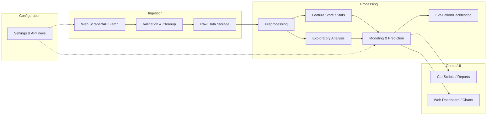
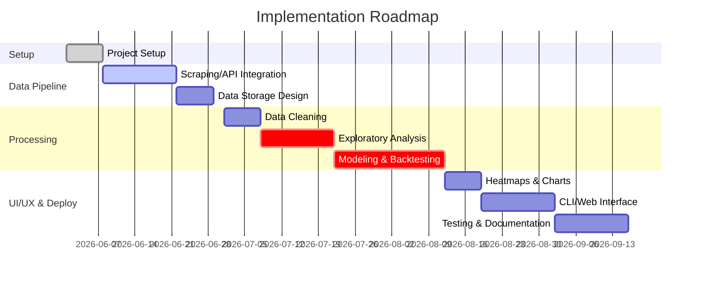

# Executive Summary

This report proposes a robust, modular Python application for ingesting, storing, and analyzing South African lottery results (Lotto, Powerball, Daily Lotto, etc.). We identify **data sources** (official sites, archives, APIs, CSVs), design a **unified schema** for multiple games, and outline an **ingestion pipeline** (web scraping, API calls, CSV import, validation, storage). We detail **preprocessing** (deduplication, handling draw anomalies, time windows) and extensive **exploratory analysis** (frequency distributions, hot/cold numbers, consecutive gaps, co-occurrence of pairs/triples, positional analysis). We survey **statistical and ML methods** – from Bayesian inference and Markov chains to clustering, association rules, random forests and neural nets – while stressing the fundamental randomness of draws【48†L109-L117】【37†L128-L136】. We define **evaluation metrics** and a backtesting framework (e.g. simulating “predictions” against historical draws). We describe **heatmap generation** (using Python libraries like Seaborn/Matplotlib) for visualizing number patterns【53†L217-L225】. We propose a **modular architecture** (Mermaid diagram below) facilitating extension to other countries/games, and outline UI/UX options (CLI tools, web dashboards). Finally, we cover reproducibility, ethical considerations (e.g. disclaimer that past draws don’t predict future ones【37†L128-L136】), assumptions, inputs/outputs, performance targets, and a detailed implementation roadmap with milestones, effort estimates, and risks.

## Data Sources 

We prioritize **official** sources but also note useful unofficial archives:

- **SA National Lottery (Ithuba) website**: the official results portal (nationallottery.co.za). Results are updated live after each draw【44†L156-L164】. However, the site uses JavaScript to render historical results; raw HTML scraping yields no data【48†L85-L94】. The example R script shows how to POST to `https://nationallottery.co.za/index.php?task=results.redirectPageURL&...` with parameters like `gameName=LOTTO` and `drawNumber` to retrieve JSON results【48†L187-L194】. This is an *unofficial API* and must be maintained if the site structure changes. Data includes draw date, winning numbers, bonus balls, division payouts, sales, etc.【37†L211-L219】【37†L223-L227】. 
- **ResultsZA API**: A third-party developer API covering SA games. It provides JSON endpoints for latest results, game-specific draws, hot/cold stats, frequencies, etc. Example response (see “Latest Results”) includes fields like `"winning_numbers"`, `"bonus_ball"`, `"total_sales"` for each game【55†L96-L104】【55†L105-L110】. E.g. a Daily Lotto response:  
  ```
  {"daily_lotto_results":{
      "date":"2024-12-10T20:00:00Z","winning_numbers":[5,11,20,28,35],"bonus_ball":null,...
    },
   "lotto_results":{
      "date":"2024-12-07T20:00:00Z","winning_numbers":[10,20,30,47,49,50],"bonus_ball":21,...
    }
  }
  ```  
  This allows programmatic data access (API key required)【55†L96-L104】【55†L105-L110】.
- **Official CSV/Archives**: If available, archived results files or lottery commission datasets. (No public CSV found for SA, but some operators publish archives; no direct citations found.)
- **Kaggle and community datasets**: E.g. a Kaggle set contains 2000–2015 results (unofficial, may be outdated)【11†L243-L252】.
- **Lottery Extreme / AfricanLottery.net**: Unofficial aggregators with up-to-date lists and CSV downloads. AfricanLottery.net offers CSV downloads for each game【26†L76-L84】; LotteryExtreme.com provides latest draws and archives (HTML tables). These can supplement data but are not “official”【26†L76-L84】【44†L156-L164】.
- **Other**: Apps (Apple/Google) and global APIs (e.g. Lottery API services) exist but often require paid access or have usage limits.

**Table: Data Source Comparison**

| Source                    | Games Covered           | Format             | Official?         | Notes                                 |
|---------------------------|-------------------------|--------------------|-------------------|---------------------------------------|
| SA National Lottery site  | Lotto, Powerball, Daily Lotto, etc | Dynamic web (JSON via POST) | ❌ (no public API, needs scraping) | Official data; JS-rendered (requires form POST)【48†L85-L94】. |
| ResultsZA API             | SA Lotto, Powerball, Daily, Plus | JSON (REST)       | ❌ (third-party, subscription) | Easy REST access (API key)【55†L96-L104】【55†L105-L110】. |
| AfricanLottery.net (CSV)  | SA Lotto, Powerball, Daily, etc | CSV download (HTTP) | ❌           | Unofficial; provides CSV archives【26†L76-L84】. |
| LotteryExtreme.com        | SA Lotto, Powerball, Daily, etc | HTML tables       | ❌           | Unofficial; scrapes from broadcasts. |
| Kaggle Datasets           | SA Lotto, Powerball    | CSV (file)         | ❌           | Historical data (often outdated).    |
| Local (scraped files)     | any                     | CSV/DB            | N/A             | Custom collection via pipeline.      |

## Data Schema 

We propose a unified schema to handle multiple game types. Key fields include draw identifiers, date, game name, country, winning numbers, bonus numbers, jackpot, sales, etc. Example schema (SQL-like) for a **“Draws”** table:

| Field         | Type      | Description                                            |
|---------------|-----------|--------------------------------------------------------|
| `draw_id`     | INTEGER   | Unique draw identifier (per game)                      |
| `game`        | TEXT      | Game name (e.g. "Lotto", "Powerball", "Daily Lotto")   |
| `country`     | TEXT      | Country code (e.g. "ZA")                               |
| `draw_date`   | DATE      | Date of draw                                          |
| `numbers`     | TEXT      | Comma-separated winning numbers (e.g. "5,12,23,34,45") |
| `bonus_ball`  | INTEGER   | Bonus/powerball number (NULL if none)                  |
| `jackpot`     | REAL      | Jackpot amount (currency)                              |
| `total_sales` | REAL      | Total ticket sales for draw                            |
| `extra`       | JSON      | (Optional) any extra info (e.g. machine, ball set)     |

For games with fixed-size numbers, one might also use separate columns (`ball1`..`ball6`). Below is a **sample data** row for a Lotto draw vs a Daily Lotto draw:

| draw_id | game       | country | draw_date  | numbers     | bonus_ball | jackpot     | total_sales |
|---------|------------|---------|------------|-------------|------------|-------------|-------------|
| 2472    | Lotto      | ZA      | 2024-12-07 | 10,20,30,47,49,50 | 21         | R4,500,000 | R16,554,055 |
| 2098    | Daily Lotto| ZA      | 2024-12-10 | 5,11,20,28,35      | –          | R120,000   | R3,262,896  |

*(Above values from official sources【55†L96-L104】【55†L105-L110】.)*

## Ingestion Pipeline 

A modular pipeline should support multiple sources:

- **Web Scraping (Official site)**: Use `requests` or `httpx` to POST to the lottery site’s endpoints as shown in 【48†L187-L194】. E.g. in Python:
  ```python
  import requests
  url = "https://www.nationallottery.co.za/index.php?task=results.redirectPageURL&Itemid=265..."
  data = {"gameName": "LOTTO", "drawNumber": "1506", "isAjax": "true"}
  res = requests.post(url, data=data)
  draw = res.json()["data"]["drawDetails"]
  ```
  Loop over draw numbers (e.g. from first available to latest). Use `try`/`catch` and `time.sleep` to handle rate limits.  
- **API Calls (ResultsZA)**: Request endpoints like `get_latest_results` or `get_results_by_game`. E.g. using `requests.get()` with API key. Parse JSON (structure shown above【55†L96-L104】【55†L105-L110】) into records.  
- **File Import (CSV)**: Periodically download CSVs from AfricanLottery.net or others. Pandas can read `pd.read_csv(url)`. Or load existing CSVs if provided (e.g. Kaggle dump).  
- **Validation**: For each record, check formats (dates parseable, number counts correct). Remove duplicates (e.g. if both CSV and API cover same draw). Verify sequence continuity: detect missing draws (e.g. non-consecutive draw IDs) and log warnings.  
- **Storage**: Options include flat files, SQLite, PostgreSQL, or NoSQL. The choice depends on scale. For a few thousand draws, a local SQLite or PostgreSQL is sufficient. For extensibility (multiple countries), a relational DB is flexible for queries. We will store raw and cleaned data. 

**Table: Storage Options**

| Option      | Type        | Pros                            | Cons                      |
|-------------|-------------|---------------------------------|---------------------------|
| CSV files   | Flat file   | Simple, human-readable          | No indexing, concurrency issues |
| SQLite      | Embedded SQL| Zero-setup, ACID, good for prototyping | Not ideal for heavy concurrency |
| PostgreSQL  | SQL         | Robust queries, ACID, scales well | Requires admin, setup |
| MongoDB     | NoSQL       | Flexible schema (JSON-friendly) | More complex queries, not relational |
| Cloud DB    | SQL/NoSQL   | Scalable, managed               | Cost, requires internet access |

## Preprocessing 

Key cleaning steps:

- **Deduplication**: Ensure each draw is stored once. If using multiple sources, merge and remove repeats.
- **Missing Draws**: Identify any gaps in draw numbers/dates. For example, verify that draws follow expected schedule (e.g. Lotto twice weekly, Daily Lotto every day). Fill gaps (if data missing) or mark them.
- **Game Changes**: Handle rule changes. Notably, Lotto ball count changed: originally 49 balls, expanded to 52 (Aug 2017)【48†L109-L118】, and to 58 in Sep 2025【50†L245-L253】. Our schema accommodates this by simply allowing numbers up to the new range. If analysis segments by era, ensure the model knows which range applied.  
- **Time Windows**: Support analysis on arbitrary windows (e.g. “last 6 months” vs “all history”). Likely filter data by date or draw ID.  
- **Feature Engineering** (optional for ML): From raw draws, one can compute features such as: days since last draw per number, frequency in last N draws, binary indicator if number appeared in previous draw, etc.

## Exploratory Analysis 

We will compute and visualize basic statistics:

- **Frequency Counts**: Compute how often each number is drawn. E.g. `freq = df.numbers.explode().value_counts()`. Plot as bar charts. This yields "hot" (frequent) vs "cold" (infrequent) numbers. (Though theoretically uniform, some variation is expected by chance【37†L128-L136】.)
- **Hot/Cold Trends**: Divide history into recent vs older periods. Compare frequencies (e.g. last 100 draws vs all draws) to identify any recent hot or cold numbers. Use line or bar plots.
- **Consecutive/Cycle Analysis**: Examine streaks of repeated numbers. E.g. how often numbers appear in successive draws. Or count the gap (number of draws) between appearances for each number.
- **Gaps/Intervals**: For each number, compute distribution of draw-intervals between its appearances. Plot histograms.
- **Pair/Triple Co-occurrence**: Use association analysis or simple counts: count how often each pair or triple of numbers appeared together. This can highlight lucky pairs. A co-occurrence matrix (heatmap of pair frequencies) is informative. One can use pandas crosstab or itertools on draw numbers to build a 2D frequency matrix.
- **Positional Analysis**: If treating draw as ordered (first ball, second ball, ...), check if some numbers tend to appear in certain positions. (Likely random, but can be checked.)  
- **Visualizations**:  
  - **Heatmap**: A 2D heatmap of number frequencies or pair co-occurrences using seaborn (for example). Seaborn’s `heatmap()` plots a color-coded matrix【53†L217-L225】.  
  - **Bar Charts**: Number frequency histogram.  
  - **Timeline Plots**: Jackpot over time or number-of-winners trends.  
  - **Pair Plot / Network**: (Optional) show graph of number connections for high co-occurrence.

*Example code (Python, pseudocode for heatmap)*:  
```python
import seaborn as sns, matplotlib.pyplot as plt
# suppose co_matrix[i,j] = count of draws where numbers i and j appeared together
sns.heatmap(co_matrix, cmap='viridis', square=True)
plt.title("Number-Pair Co-occurrence Heatmap")
plt.xlabel("Number")
plt.ylabel("Number")
plt.show()
```

## Statistical & Machine Learning Methods 

A variety of methods could be applied, with caution that lottery draws are random and independent【37†L128-L136】. Typical approaches include:

- **Bayesian Models**: Assign priors to number probabilities; update with observed frequencies. (Often ends up resembling simple frequency counts.)
- **Markov Chains**: Model the probability of a number appearing given the previous draw’s outcome. E.g. a Markov model on the space of drawn sets or on individual numbers. Some enthusiasts attempt Markov chains, though it inherently relies mostly on the latest state【48†L187-L194】.  
- **Time-Series Models**: For sequence data (e.g. jackpot amounts or number frequencies over time), ARIMA or exponential smoothing could be used, though the series is mostly white noise.
- **Clustering**: Cluster historical draws to identify patterns (e.g. “rare” vs “common” draws). Might segment data for localized analysis.
- **Association Rules / Frequent Itemsets**: Treat each draw as a “transaction” of numbers. Use Apriori or FP-Growth algorithms to find frequently co-occurring number sets (pairs, triples). Papers suggest treating each number as an item and mining association rules【35†L1-L9】. For example, the FP-growth algorithm can find rules like “if 5 and 12 are drawn, 23 appears in 15% of those draws.” This uncovers non-random patterns if any exist.
- **Classification (Random Forests, Neural Nets, etc.)**: Frame as binary classification: for each number and draw, predict “drawn (1) or not (0)” using features (e.g. number's recent frequency, draw index). A Random Forest could be trained on historical draws to predict the next draw’s numbers (or at least ranking numbers by probability). Neural networks (e.g. RNNs processing sequence of draws) could be attempted to model complex patterns. However, **due to true randomness, these models have no proven predictive power** – any patterns found are likely spurious.  
- **Generating Picks**: Some tools use ML to generate “likely” picks. The ResultsZA API even includes a “generate random numbers” endpoint using game rules (which is essentially random). One may experiment with adversarial or reinforcement learning (framing number-picking as a game), though success is doubtful.

In practice, the **independence of draws** means past frequencies do *not* influence future draws【37†L128-L136】. We include these methods for completeness, but emphasize all predictions are speculative.

## Evaluation and Backtesting 

We need a framework to **evaluate any prediction strategy**. Since we cannot know the future, we use historical backtesting:

- **Prediction Task**: Define how we "predict" numbers. For example, each week/period generate a set of numbers (e.g. 6 for Lotto) using some heuristic/model. 
- **Metrics**: Count how many predicted numbers match the actual draw (“hits”), or whether the predicted combination would have won a prize tier. Metrics could include *precision/recall* of predicted number sets, or *average hits per draw*. Since jackpots rarely hit, a useful metric might be “would this strategy have yielded any Division-1 winners historically?”
- **Simulation**: For each draw in a test period, use only prior data (before that draw) to train or choose numbers, then compare to actual draw. E.g.  
  ```python
  hits_list = []
  for date in test_dates:
      train_data = all_data[all_data.draw_date < date]
      pred_nums = strategy.predict(train_data)  # returns list of numbers
      actual = get_draw(date)['numbers']
      hits = len(set(pred_nums) & set(actual))
      hits_list.append(hits)
  avg_hits = sum(hits_list)/len(hits_list)
  ```
- **Rolling Forecast**: Could apply time-series cross-validation (e.g. expanding window).  
- **Random Baseline**: Compare any method against random picks. A good evaluation will show performance *not* significantly better than random, underscoring the unpredictability.  
- **Visualization**: A chart of predicted-vs-actual wins over time or distribution of hits.

## Heatmap Generation 

Heatmaps are useful for visualizing frequency/co-occurrence. In Python, libraries include **Seaborn** and **Matplotlib**. For instance, Seaborn’s `heatmap()` function plots a color-encoded matrix【53†L217-L225】. Example styling:

```python
import seaborn as sns
sns.set_theme(style="whitegrid")
# data_matrix is a 2D numpy array or DataFrame of counts
sns.heatmap(data_matrix, annot=True, fmt="d", cmap="coolwarm", cbar=True)
plt.title("Number-Frequency Heatmap")
plt.show()
```

This could show, e.g., how often each number (1–52) has appeared (1D) or how often each pair of numbers occurred together (2D). Other visualization styles: cluster map (hierarchical clustering on heatmap), annotated bar charts, line plots for trends, etc.

## Modular Architecture and Extensibility 

We recommend a modular design:



- **Ingestion Module**: Encapsulates all data fetching (scrapers, API clients). Each game (Lotto, Daily, Powerball) can have its own fetcher class. Easy to add new games or countries by implementing a new fetcher.
- **Data Storage**: Raw data stored in a database or files. Schema versioning ensures new fields can be added.
- **Processing Module**: Data cleaning, feature engineering, and analysis (exploratory and modeling). Each analysis task (frequency, co-occurrence) is a separate function/class for clarity.
- **Modeling Module**: Contains statistical analyses and ML algorithms. Can plug in new models or algorithms easily.
- **Evaluation Module**: For backtesting frameworks and metrics.
- **UI/UX Module**: CLI tools and/or web frontend (e.g. Streamlit or Dash apps). These use processed data or model outputs.

This layered architecture enables extension to other countries’ lotteries by adding new ingestion classes and minor adjustments (e.g. different number ranges). 

## UI/UX Options 

- **CLI Tool**: A command-line interface (using Python’s `argparse` or `click`) can allow scheduling data fetches, running analyses, and exporting CSV/plots. Easy integration into cron jobs or pipelines.
- **Web/Dashboard**: A web app (Flask/Django, or easier Streamlit/Plotly Dash) for interactive charts and number generation. For example, a dashboard with frequency plots, heatmaps, and a “Predict my numbers” tool.
- **Notebook Reports**: Jupyter or Voila dashboards for analysts to run exploratory code and share insights.
- **Mobile App**: The official app (by Ithuba) exists, but our tool could be paired with a mobile-friendly front end if desired.

## Reproducibility and Ethics 

- **Reproducibility**: The codebase should use version control (Git), environment specs (requirements.txt or Conda), and containerization (Docker). Analyses should be scripted or in notebooks with fixed random seeds for any stochastic components. All data transformations and model code must be logged or documented for auditability.
- **Ethics & Legal**: Important disclaimers: *“Lottery numbers are drawn randomly; past draws do not influence future ones”*【37†L128-L136】. We must not claim to *predict* winning numbers or guarantee success. If publishing visualizations or “likely picks”, include warnings about the randomness of lotteries. Also ensure we comply with any terms of service when scraping or using official data. The tool is for *analysis and education*, not illegal number manipulation.  
- **Legal Note**: Gambling is regulated; using this tool for gambling advice should adhere to local laws. We include references to the randomness principle and clarify that any “predictions” are purely speculative.

## Assumptions, Inputs, Outputs, Performance 

- **Assumptions**: We assume continuous internet access to data sources (or local archives); that lottery draw formats (number ranges, draw days) are known; and that APIs or sites are reachable. We assume historical data is correct and complete.  
- **Inputs**: API keys or credentials (for ResultsZA or others), target draw range or date range, choice of games to analyze, and optional user parameters (e.g. number of “likely” picks).  
- **Outputs**: Processed dataset of draws; frequency tables; heatmap image(s); charts of hot/cold numbers; candidate number sets; evaluation statistics (hit rates, charts); logs of pipeline runs.  
- **Performance**: The data volume is modest (thousands of draws), so real-time performance is not critical. Ingestion can run daily (or weekly) without heavy resources. Analysis (frequency counting, basic ML) is lightweight (<1 second for a dataset of this size on a modern CPU). Only large operations (e.g. training a complex neural net) might be time-consuming, but are not needed here. Scalability for additional countries would mainly increase storage and slight computation.

## Implementation Roadmap 

**Milestones & Effort (weeks):**

1. **Project Setup (1 wk)**: Define requirements, set up Git repo, environments. **Risk:** Underestimate complexity of site scraping.  
2. **Data Collection Module (2–3 wk)**: Implement scrapers for Lotto, Daily, Powerball using official site & API. Test with historical draws (e.g. first and latest draws)【48†L187-L194】【55†L96-L104】. *Effort:* 2 devs × 2 wk. **Risks:** Site structure changes; blocked requests (mitigate with polite intervals and User-Agent headers).  
3. **Data Storage & ETL (1–2 wk)**: Design database/schema (as above), implement load/merge scripts. **Risk:** Schema change (e.g. new fields) – mitigate by schema versioning.  
4. **Preprocessing & Cleaning (1 wk)**: Deduplicate data, handle missing draws, adjust for rule changes (validate ball count consistency). *Effort:* 1 dev × 1 wk.  
5. **Exploratory Analysis (2 wk)**: Compute frequencies, co-occurrence, plots, hot/cold tables. Generate code examples and visual outputs. *Effort:* 2 devs × 2 wk (overlapping with step 3/4). **Risk:** Visualization library issues – mitigate by testing on sample data.  
6. **Modeling & Number Generation (3–4 wk)**: Implement selected algorithms (e.g. association mining, a simple random-forest heuristic, etc.), integrate evaluation metrics and backtesting. *Effort:* 2 devs × 4 wk. **Risks:** Overfitting to noise; results may be non-significant. Emphasize analysis, not prediction.  
7. **Evaluation Framework (1–2 wk)**: Set up backtesting using historical splits, compute hit metrics vs random baseline. *Effort:* 1 dev × 2 wk.  
8. **Heatmap & Visual Tools (1 wk)**: Finalize plotting functions (heatmap, frequency charts). Optional: interactive visualizations. *Effort:* 1 dev × 1 wk.  
9. **UI/CLI & Reporting (2 wk)**: Develop CLI interface and generate summary report (could be a Markdown/Jupyter template). Possibly build a simple web dashboard for exploration (e.g. Streamlit app). *Effort:* 2 devs × 2 wk. **Risk:** UI complexity (start minimal, expand if time allows).  
10. **Testing & Deployment (1–2 wk)**: Unit tests for pipeline, integration tests; documentation. Deploy on target environment (on-prem or cloud VM). *Effort:* 1 dev × 2 wk.  



*Legend:* **dev1, dev2, dev3** denote different developer efforts. **Risks:** Changes in lottery rules/sites; randomness limits success; integration complexity. Each milestone should include risk assessments (e.g. site change -> need to re-scrape).

## Summary of Key Insights

- **Data Sources:** Combine official (scraping) and API data【48†L85-L94】【55†L96-L104】. Use aggregator CSVs for redundancy.  
- **Schema:** A unified draws table with fields like `numbers` and `bonus_ball`. See sample schema above.  
- **Pipeline:** Modular fetching (e.g. Python requests POST for official site【48†L187-L194】), parse JSON, store in DB. Validate each step.  
- **Analysis:** Compute standard lottery stats (frequency, hot/cold, pair heatmaps, gaps, positional) and visualize them. Example: seaborn heatmap for co-occurrences【53†L217-L225】.  
- **Modeling:** Many statistical/ML approaches exist (Bayesian, Markov, ML classifiers, association rules) but emphasize **randomness** of lottery【37†L128-L136】. Any model’s output is heuristical.  
- **Evaluation:** Use backtesting on historical data, measure how often “predicted” numbers would have hit. Always compare against a random baseline.  
- **Architecture:** Layered for extensibility (see flowchart). Can add other countries by implementing new ingestion modules.  
- **UI/UX:** Options include CLI scripts, interactive dashboards (Plotly, Dash, Streamlit), or static HTML reports.  
- **Reproducibility:** Use version control, fixed seeds, documented environment.  
- **Ethical/Legal:** Include disclaimers about independence and no guaranteed wins【37†L128-L136】. Use data responsibly.

All code should be well-documented. Although some heuristics might seem to “improve” odds, due to draw independence any selection is effectively random. This project is valuable for demonstrating data analysis skills and transparency, not for beating the lottery. All results are for educational purposes.

